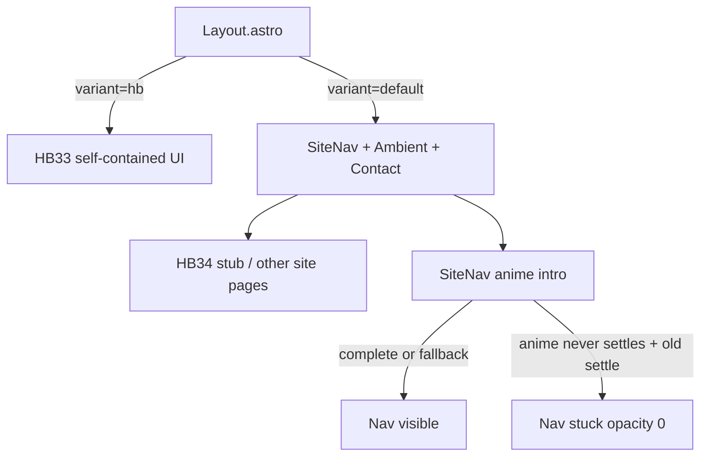

# HB pages — architecture and animation failures

Reference for birthday (“HB”) routes: how they are built, how they differ from the rest of the site, and why the SiteNav intro can leave the chrome invisible.

## Two page models

`Layout.astro` gates shared chrome with `variant`:

```ts
const showChrome = variant === "default";
// AmbientBackground, SiteNav, ContactModal only when showChrome
```

| Model | Example | Layout | Chrome |
| --- | --- | --- | --- |
| `variant="hb"` | HB33 | Full-bleed birthday UI | **No** SiteNav / ambient / contact modal |
| `variant="default"` | HB34 stub | Normal site page | SiteNav + ambient + contact |



**Implication:** Opening HB33 does **not** exercise the SiteNav intro. Opening HB34 (or Home / Services) does. A latent nav bug can look like “HB34 is broken” even though HB33 still looks fine.

---

## File map

### HB33 (`variant="hb"`) — frozen

- Routes: [`src/pages/en/HB33.astro`](../src/pages/en/HB33.astro), [`src/pages/es/HB33.astro`](../src/pages/es/HB33.astro)
- Local [`language-switcher.astro`](../src/components/language-switcher.astro) (positioned on the page)
- Copy under `birthday.*` in [`src/i18n/en.json`](../src/i18n/en.json) / [`es.json`](../src/i18n/es.json)
- Listed in [`.cursorignore`](../.cursorignore) — do not develop further without an explicit decision to unfreeze

### HB34 (`variant` default) — stub

- Routes: [`src/pages/en/HB34.astro`](../src/pages/en/HB34.astro), [`src/pages/es/HB34.astro`](../src/pages/es/HB34.astro)
- Shared body: [`src/components/hb34-page.astro`](../src/components/hb34-page.astro)
- Uses normal layout chrome (`ambientSubtle`); placeholder copy only for now

### Navigation

- [`src/components/site-nav.astro`](../src/components/site-nav.astro) — Birthdays group linking HB33 / HB34
- i18n keys: `navigation.birthdays`, `navigation.hb33`, `navigation.hb34`

### Layout gate

- [`src/layouts/Layout.astro`](../src/layouts/Layout.astro) — `variant?: "default" | "hb"`; `data-page={variant}` on `<body>`

---

## Postmortem: SiteNav intro invisible

### Symptoms

- Page content (e.g. HB34 heading) rendered.
- Logo, nav links, language/theme controls missing or fully transparent.
- HB33 still looked correct (no SiteNav on that variant).

### Root cause

Not “HB34 broke anime.js.” The intro path in SiteNav had a fail-closed hide:

1. CSS hides items while `.site-nav` lacks `is-intro-done`:

   ```css
   .site-nav:not(.is-intro-done) .cz-logo,
   .site-nav:not(.is-intro-done) .nav-link,
   /* … */ { opacity: 0; }
   ```

2. Script sets **inline** `opacity: 0` and `translateY(-10px)` before anime runs.

3. Anime should animate to visible and call `settleNavIntro`.

4. Original `settleNavIntro` only did `nav.classList.add("is-intro-done")` and **did not clear inline styles**.

5. Inline `opacity: 0` beats the class rule `opacity: 1`. If anime never completes (background tab, blocked ticks, tooling environments where anime does not advance, etc.), the nav stays invisible forever.

Adding HB34 links to the menu was **not** the root cause. HB34 simply became the first birthday route that mounts SiteNav, so the latent bug showed up there.

### Mitigation (current SiteNav)

In [`site-nav.astro`](../src/components/site-nav.astro):

- `settleNavIntro` removes inline `opacity` / `transform`, then adds `is-intro-done`.
- ~1200ms timeout still calls `settleNavIntro` if anime never fires `complete`.
- Tween targets end numbers for opacity (`0.45` / `1`) and `translateY: 0` (slightly different feel than the original `[0, 1]` / `[-10, 0]` from-to form).

### Why HB33 did not catch it

`variant="hb"` → `showChrome === false` → no SiteNav script, no intro. Validating birthday work **only** on HB33 will miss SiteNav regressions.

---

## Parallel pattern: home hero

[`header-left-side.astro`](../src/components/header-left-side.astro) uses a similar hide-then-anime flow:

- Elements with `.hero-enter` start hidden.
- Timeline ends by setting `html.hero-ready` (and `showHeroSettled` can force inline `opacity: 1`).
- Layout also has `html.hero-ready .hero-enter { opacity: 1 !important; }`, which is more resilient than the old nav settle.

When changing intros, treat nav and hero as the same class of risk: **hide with inline styles ⇒ settle must clear or force visible**.

---

## Checklist when touching intros

1. Assume anime may not call `complete` (background tab, reduced motion edge cases, odd hosts).
2. After setting inline hide styles, settle **must** `removeProperty` or set visible values — class-only settle is not enough.
3. Prefer a short fallback timeout in addition to `complete`.
4. Re-test on a **`variant="default"`** page (Home, Services, HB34), not only on `variant="hb"` (HB33).
5. Honor `prefers-reduced-motion: reduce` with an immediate settle path.

---

## Practical rules for new HB pages

- Choose the model deliberately:
  - Immersive invitation like HB33 → `variant="hb"` (own chrome; SiteNav not present).
  - Page inside the portfolio shell → default Layout (expect SiteNav intro).
- Prefer a shared component + thin `en`/`es` route files (HB34 pattern) unless the page must stay frozen and duplicated like HB33.
- Keep birthday invite copy in i18n (`birthday.*`) when the page is invite-shaped; nav labels stay under `navigation.*`.
